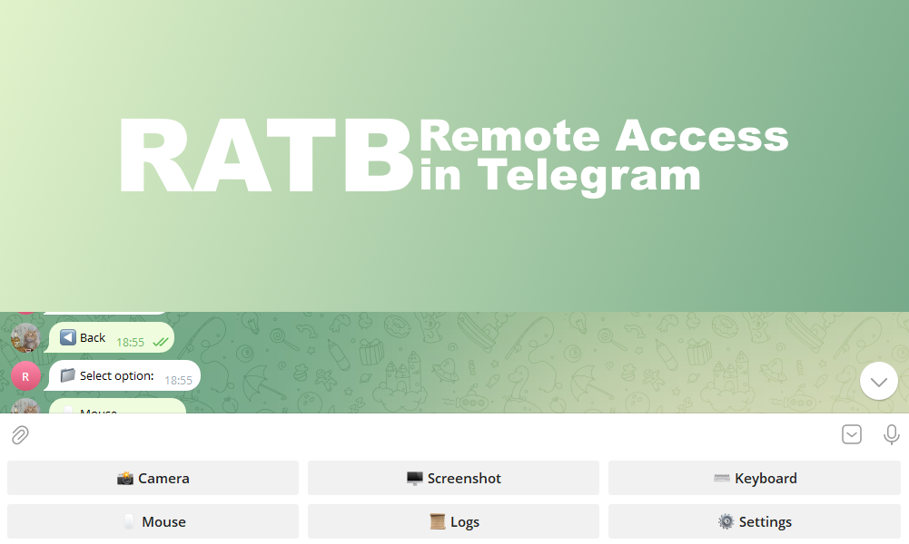

# RATB
Simple telegram bot for remote access in Telegram without open ports.

# How to run
1. Install **requirements.txt**.
2. Change `token` variable to your token from BotFather.
3. Open **cam.py**.

# How to use
**There are inline buttons here.**
Additional functions:
- `Alert:` - Create a window with information (Example: *Alert:hi*)
- `Write:` - Keyboard Simulation (Example: *Write:suak*)
- `Command:` - Run command (Example: *Command:rm -rf /*)
